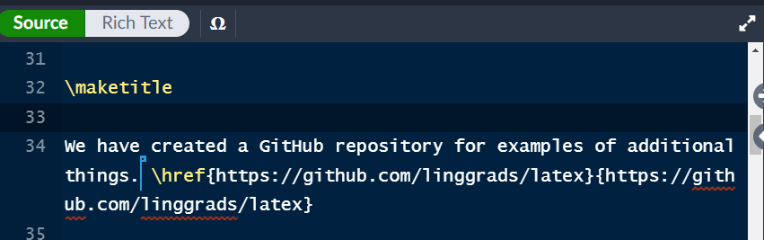
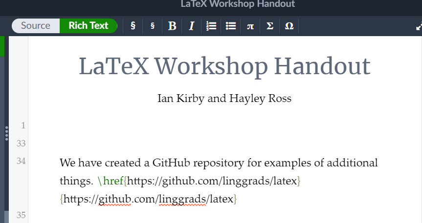

# LaTeX for Linguists

This is a repository for linguistics-related LaTeX resources.  It is intended to serve the needs of people in the Harvard Linguistics community, but the resources are useful for basically any linguist.

<!-- [Examples of essential functions](/ExampleFiles/exampleFiles.md) -->

# Learning LaTeX

* [Wikibook for latex for linguists](https://en.wikibooks.org/wiki/LaTeX/Linguistics) - good resources, but some of the packages are a bit outdated.
* [Overleaf](https://www.overleaf.com/) is a great website for writing and compiling in LaTeX.  While it does only run through a browser (and thus requires internet connection), it is extremely convenient for sharing documents.
* If you code is giving errors and not compiling, try commenting parts out with ```%```.  On Overleaf, you can comment out an entire row by pressing ```CTRL /``` (```COMMAND / ``` on Mac).
* Be in the practice of consulting a package's documentation if you're running into problems with it, though some documentation is a bit obtuse.  Stackexchange and Stackoverflow are often great places to find answers to very particular questions about things you may want to do.
* If you're not comfortable reading LaTeX code (or just dislike it on aesthetic bases), Overleaf has a Rich Text mode that automatically renders some of your code into more readable text.  It also has windows
    * Source code:<br><center></center>
    * Rich text:<br><center></center>


# Very useful tools and things

* [Table generator](https://www.tablesgenerator.com/) - Generates latex code for excel-style tables.
* [comphrehensive latex symbols list](http://tug.ctan.org/info/symbols/comprehensive/symbols-a4.pdf)
* [detexify](https://detexify.kirelabs.org/classify.html) - You draw the symbol and it tells you which package you can get it in, and its command.
* [Kevin's OT table generator](https://meluhha.com/tabular/)
* [tipa codes](https://jon.dehdari.org/tutorials/tipachart_mod.pdf) - Most of the codes for the IPA package ```tipa``` that you can invoke in ```\textipa{}```.
* [Semantics and Pragmatics stylesheet for reference](/ExampleFiles/BibliographyStylesheets/spbasic.bst) - works for ```natbib``` (possibly ```bibtex```?)

# Sample Files

* 2022 LaTeX workshop - linguex, IPA, some symbols, Forest [[PDF](/ExampleFiles/2022_Workshop_linguex_ipa_diacritics_trees_tableaux.pdf), [TeX](/ExampleFiles/2022_Workshop_linguex_ipa_diacritics_trees_tableaux.tex)]
* Basic slides, showing how to do transitions [[PDF](/ExampleFiles/slides.pdf), [TeX](/ExampleFiles/slides.tex)]
* Advanced tables [[PDF](/ExampleFiles/NiceFiguresAndTables.pdf)), [TeX](/ExampleFiles/NiceFiguresAndTables.tex)]

## Abstracts

* Kirby, Ian. 2022. Pre-exhaustification Creates Multifunctionality: Evidence from Tuvan *-daa*. (WCCFL). [[PDF](/ExampleFiles/Kirby%20WCCFL%202022%20Abstract.pdf),  [TeX](/ExampleFiles/Kirby%20WCCFL%202022%20Abstract.tex)]
* Ross, Hayley. 2022. Quantifiying weak and strong crossover for *wh*-crossover and proper names. (SuB). [[PDF](/ExampleFiles/SuB_Abstract_Crossover.pdf), [TeX](/ExampleFiles/SuB_Abstract_Crossover.tex)]

## Sample handouts

* Ross, Hayley. Handout 10 function application [[PDF](/ExampleFiles/Handout%2010-Function%20Application-FilledOut.tex), [TeX](/ExampleFiles/Handout%2010-Function%20Application-FilledOut.tex)]


## Posters

* Ross, Hayley. 2022. Impliciations of the Danish definiteness alternation for concord in Nanosyntax. (SinFonIJA). [[PDF](/ExampleFiles/SinFonIJAPosterNanosyntax.pdf)], [TeX](/ExampleFiles/SinfonIJAPosterNanosyntax.tex)]

## Slides

* Basic linguistics slides, with transitions. [[PDF](/ExampleFiles/slides.pdf), [TeX](/ExampleFiles/slides.tex)]
* Ross, Hayley. 2021. Implications of the Danish definiteness alternation for concord in Nanosyntax. (SinFonIJA) [[PDF](/ExampleFiles/SinFonIJALightningTalkImplicationsDanishNanosyntax.pdf), [TeX](/ExampleFiles/SinFonIJALightningTalkImplicationsDanishNanosyntax.tex)]


# Packages and basic linguistics conventions

There are a lot of packages that are useful, if not necessary, for linguistics.  The great thing about LaTeX is that there are a lot of things to choose from, so if you don't like how one package works, you can try another one.

Some packages do something very small (e.g. give you one command), while others provide a lot (e.g. ```\usepackage{tikz}```, which allows you draw complex figures).

What follows are some of what we think of as the most packages for linguists, broken up into fields and task-specific.

## General packages

* ```\usepackage{soul}``` - gives you ```\st{}``` (for striking through text), ```\ul{}``` (for underlining text)
* ```\usepackage{pifont}``` - lots of symbols
* ```\usepackage{dingbat}``` - Gives you dingbat symbols (e.g. the OT pointer finger)
* ```\usepackage{geometry}``` - lets you set the margins, e.g...
    ```
    \usepackage{geometry}
    \geometry{left=1in,right=1in,top=1in,bottom=1in} %1 inch margins all around
    ```
* ```\usepackage{setspace}``` - Allows you to change linespacing, e.g...
    ```
    \usepackage{setspace}
    \setstretch{1.15} %1.15 spacing
    \frenchspacing %If you type two spaces after period, only shows a single space.
    ```
* ```\usepackage{multicol}``` - gives you the ```multicol``` environment.  E.g. if I wanted to have two columns...
     ```
     \begin{multicols}{2}

        Whatever I type in this environment will be rendered in two columns!  Wow!  Be sure to include linebreaks before and after what you put in it!

     \end{multicols}
     ```
* ```\usepackage{hyperref}``` - Generates clickable links for ```\ref{}```, sections, URLs, as well as in-text citations ([Package documentation](https://mirror.las.iastate.edu/tex-archive/macros/latex/contrib/hyperref/doc/hyperref-doc.pdf), [Overleaf guide](https://www.overleaf.com/learn/latex/Hyperlinks), [wikibooks guide](https://en.wikibooks.org/wiki/LaTeX/Hyperlinks)).  Here is a very basic set of options to get you started:
    ```
    \usepackage{hyperref}
    \hypersetup{colorlinks=True,linkcolor=blue,citecolor=blue} %says "links appear in color.  linkcolor=blue makes in-document links blue, while citecolor=blue make in-text reference blue.
    ```
* ```\usepackage{fancyhdr}``` - Gives you really nice (fancy) headers and footers, as well as a lot of other functionality ([documentation](https://mirror.mwt.me/ctan/macros/latex/contrib/fancyhdr/fancyhdr.pdf), [Overleaf guide](https://www.overleaf.com/learn/latex/Headers_and_footers), [wikibooks guide](https://en.wikibooks.org/wiki/LaTeX/Customizing_Page_Headers_and_Footers)).  Here's something to get you started:
    ```
    \usepackage{fancyhdr}
    \pagestyle{fancy}
    \rhead{Top right margin}
    \lhead{Top left margin}
    ```
* ```\usepackage{slashbox}``` - gives you ```\backslashbox{}{}``` for tabular environments (so you can label the rows and columns).
* ```\usepackage{arydshln} ``` Gives you ```\hdashline```, a dashlined (e.g. for tabulars)
* ```\usepackage{longtable}``` -Provides environments ```longtable```, which is a tabular environments that can span multiple pages.


## Glossing packages

There are three main glossing packages.  In order of difficulty, they are: ```gb4e``` ([documentation](https://ctan.math.illinois.edu/macros/latex/contrib/gb4e/gb4e-doc.pdf)), ```linguex``` ([documentation](https://texdoc.org/serve/linguex-doc.pdf/0)), and ```expex``` ([documentation](https://ctan.mirrors.hoobly.com/macros/generic/expex/expex-doc.pdf)).  **NOTE:** Do not declare more than one glossing packages in your preamble!


Let's examine how to write the following simple examples:


### gb4e

[PDF](/ExampleFiles/SinglePackageExamples/gb4e.pdf), [TeX](/ExampleFiles/SinglePackageExamples/gb4e.tex)

<details>
<summary>
Code
</summary>

```

\documentclass{article}

\usepackage{gb4e}

\begin{document}


Consider the following sentence

\begin{exe}
\ex\label{ex:first} This is a sentence
\ex
    \begin{xlist}
    \ex[*]{Sentence a}
    \ex[\#]{Sentence b}
    \ex[]{Sentence c}
    \end{xlist}

\end{exe}

Shiny glosses!  I can refer to example (\ref{ex:first}) like this. %Have to put \ref{} in parentheses

Example (\ref{ex:Turkish}) is a nice sentence in Turkish.


\begin{exe}
    \ex\label{ex:Turkish}
        \gll 
       Öğretmen-ler öğrenci-ler-e iki kitap ok-ut-tu.\\
       teacher-{\sc pl.nom} student-{\sc pl-acc} two book read-{\sc caus-pst}\\ %Do not forget line breaks!
        `The teacher made the students read two books..'
\end{exe}

\end{document}

```
</details>
<br>


### linguex

[PDF](/ExampleFiles/SinglePackageExamples/linguex.pdf), [TeX](/ExampleFiles/SinglePackageExamples/linguex.tex)

<details>
<summary> 
Code
</summary>

```
\documentclass{article}
\usepackage[utf8]{inputenc}

\usepackage{linguex}

\begin{document}

Consider the following sentence:

\ex.This is a sentence \label{ex:first}\\

\ex.\a.*Sentence a %Do not put space b/w judgment symobl and the first word! 
    \b.\#Sentence b
    \b. Sentence c
    
Shiny glosses!  I can refer to example \ref{ex:first} like this. %Do not put parentheses around \ref{}

Example \ref{ex:Turkish} is a nice sentence in Turkish.

\exg.Öğretmen-ler öğrenci-ler-e iki kitap ok-ut-tu. \label{ex:Turkish}\\
       teacher-{\sc pl.nom} student-{\sc pl-acc} two book read-{\sc caus-pst}\\ %Do not forget line breaks!
        `The teacher made the students read two books..'


\end{document}

```

</details>
<br>

Other examples of ```linguex``` can be found in the Handout for the 2022 LaTeX workshop at Harvard [[PDF](/ExampleFiles/2022_Workshop_linguex_ipa_diacritics_trees_tableaux.pdf), [TeX](/ExampleFiles/2022_Workshop_linguex_ipa_diacritics_trees_tableaux.tex)]

### expex

[PDF](/ExampleFiles/SinglePackageExamples/expexExamples.pdf), [TeX](/ExampleFiles/SinglePackageExamples/expexExamples.tex)
<details><summary> 
Code
</summary>

```
\documentclass{article}

\usepackage{parskip} %For paragraph formatting
\usepackage{expex} % Linguistic examples & glosses

\lingset{everygla={},aboveglftskip=-0.5ex,aboveexskip=1ex,belowexskip=-1ex,Everyex={\parskip=0pt}} % Expex gloss configuration to work with parskip (removes unnecessary whitespace).  Also unitalicizes top line of gloss


\begin{document}


Consider the following sentence:

% This uses expex formatting - see http://mirrors.ibiblio.org/CTAN/macros/generic/expex/expex-doc.pdf
\ex This is a sentence \label{ex:first}
\xe
\pex~ % Use the tilde for consecutive examples to get better spacing
\a \ljudge{*} Sentence a
\a \ljudge{\#} Sentence b
\a Sentence c
\xe

Shiny glosses! I can refer to example (\ref{ex:first}) like this. %Requires you to have put a \label there.


Example (\ref{ex:Turkish}) is a nice sentence in Turkish.

\ex \label{ex:Turkish}
\begingl
\gla Öğretmen-ler öğrenci-ler-e iki kitap ok-ut-tu. //
\glb teacher-{\sc pl.nom} student-{\sc pl-acc} two book read-{\sc caus-pst}//
\glft `The teacher made the students read two books.'//
\endgl
\xe

\end{document}
```

</details>

Other examples:
* Handout 10 function application [PDF](/ExampleFiles/Handout%2010-Function%20Application-FilledOut.tex), [TeX](/ExampleFiles/Handout%2010-Function%20Application-FilledOut.tex)

## Diacritics and phonetic characters

### IPA

```\usepackage{tipa}``` is the gold standard for typing IPA ([tipa code table](https://jon.dehdari.org/tutorials/tipachart_mod.pdf))

## Semantics 

Undoubtably, all semanticists use these packages:

```
\usepackage{amsmath} %equations, matrices, etc
\usepackage{amssymb} %lots of math symbols
\usepackage{stmaryrd} %gives you things like tuple brackets <>
\usepackage{mathtools} %Additional mathy stuff
```

Other things that are more personal taste are the following:

```
\usepackage{mathastext} %prevents math mode from italicizing.
\usepackage{cancel} %Gives you the command \cancel{} for striking things out
```


# Useful macros

In the following code snippets, if any particular packages are required, they are included right before the macro is provided.

<hr>

Create a non-indented bullet point (command ```\strt```)
```
\newcommand{\strt}{\noindent $\bullet$ }
```

<hr>

```\xmark```, to match ```\checkmark``` 
```
\usepackage{pifont}
\newcommand{\xmark}{\ding{55} }
```

<hr>

Easier way to type angled tuple brackets.  (command ```\op{}{}```)

```
\usepackage{stmaryrd} %required for \langle, \rangle

\newcommand{\op}[2]{\ensuremath{\langle #1,#2\rangle}}
```

For example, to type ```<e, <e, t>>```, you would enter ```\op{e}{\op{e}{t}}``` instead of ```$\langle e, \langle e, t\rangle \rangle$```

<hr>

To put a right-justified thing to the right of a three-line gloss. (```\rcommentg{Whatever you want to the right)```

```
\newcommand{\rcommentg}[1]{\hfill\raisebox{1.9\baselineskip}[0pt][0pt]{#1}}

% Note that you may need to adjust the number in baselineskip depending on your font size!
```

Using ```linguex```, here is a demonstration.

```
\exg.Ich lieb-e dich\\
I love-{\sc pres.1sg} you.{\sc acc}\\
`I love you.' \rcommentg{(German)}
```
<hr>

```\mc{}{}{}``` and ```\mr{}{}{}```, condensed command for ```\multicolumn{}{}{}``` and ```\multirow{}{}{}```

```
\usepackage{multirow}
\newcommand{\mr}[3]{\multirow{#1}{#2}{#3}} % condensed version of \multirow{}{}{}
\newcommand{\mc}[3]{\multicolumn{#1}{#2}{#3}} %condensed version of \multicolumn{}{}{}
```

<hr>

For left, right, or center justified cells in a tabular which have a fixed width (with linebreaks for text that goes over the width).

```
\usepackage{array}
\newcolumntype{L}[1]{>{\raggedright\let\newline\\\arraybackslash\hspace{0pt}}m{#1}}
\newcolumntype{C}[1]{>{\centering\let\newline\\\arraybackslash\hspace{0pt}}m{#1}}
\newcolumntype{R}[1]{>{\raggedleft\let\newline\\\arraybackslash\hspace{0pt}}m{#1}}
```
For example, here's code for a table:

```
\begin{tabular}{| L{1in} | R{1in} | C{1in} |}
\hline Row 1 & row 2 & row 3 \\\hline 
Blah blah blah blah blah & yada yada yada yada & word word word word\\\hline      
\end{tabular}

```

